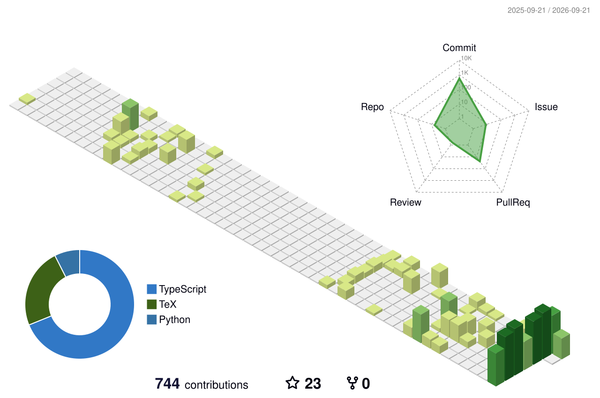

  
  
  
  

### ~/about

I build production systems that ship: the React and Next.js front end, the Django and FastAPI back end, and the Docker, Terraform and CI/CD plumbing that gets them to users.

- **Shipped:** team lead on MYLDV, a React + Lumen SaaS.
- **Building:** [Navo](https://github.com/khannoussi-malek/navo), ask your databases questions in plain English. And [PaperLab](https://github.com/khannoussi-malek/PaperLab), a local-first research reader whose AI answers cite the exact PDF page.
- **Researching:** [architectural refactoring in Apache projects](https://github.com/khannoussi-malek/refactoring-review-friction), an empirical study that mined 51,861 refactorings from Hadoop.
- **Looking for:** a Full-Stack / DevOps role in Berlin or Potsdam. EU Blue Card eligible.

### ~/stack

**Frontend** 

**Backend** 

**Data** 

**DevOps** 

### ~/pipeline

### ~/activity

<!-- Regenerated daily by .github/workflows/profile-3d-contrib.yml -->
<picture>
  <source media="(prefers-color-scheme: dark)" srcset="profile-3d-contrib/profile-night-rainbow.svg">
  
</picture>

> [!NOTE]
> Graph looking quiet? You're on the free tier. Most of my commits live in private repos, the ones that pay the bills.

  

